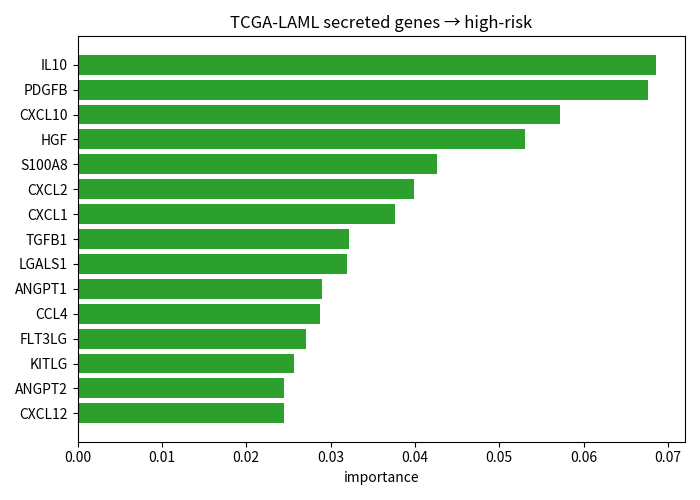
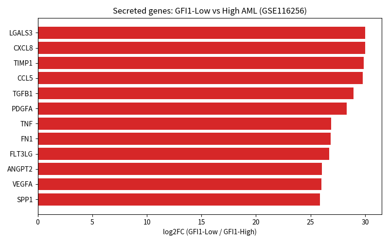
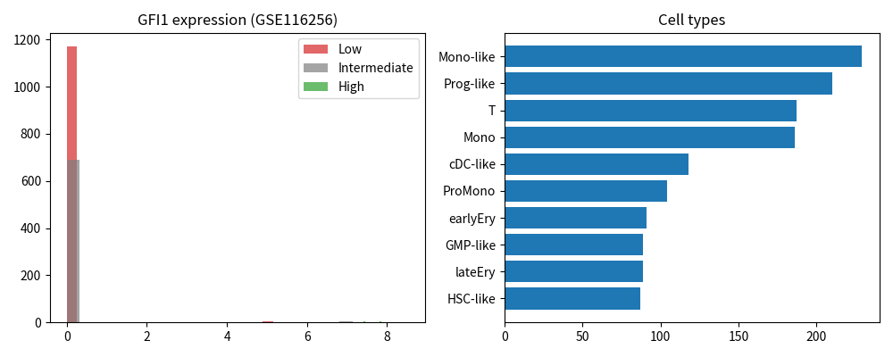
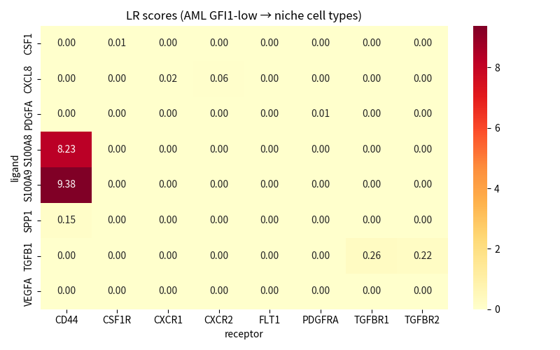

# Mapping Gfi1-Regulated Intercellular Signaling & Niche Remodeling in AML

[](https://www.python.org/downloads/)
[](LICENSE)
[](#results-from-real-public-data)

---

## What this project is about

**Acute Myeloid Leukemia (AML)** lives in the bone marrow niche. Leukemic cells reshape that niche so stromal, endothelial and immune cells help protect them from therapy.

**Gfi1** is a transcriptional repressor. When it is lost or down-regulated:

1. Target genes are no longer repressed  
2. Those genes produce **secreted signals** (cytokines, chemokines, matrix factors)  
3. The signals bind receptors on neighboring niche cells  
4. The niche becomes a protective shield → worse outcome  

**Question this repo answers:**  
Which secreted signals rise when Gfi1 is low, which of them associate with clinical risk, and which receptors on niche cells do they engage?

The pipeline maps this axis using **public real data** (TCGA-LAML + GSE116256) and produces tables, figures and a summary report.

---

## Biological logic (one diagram)

```
Gfi1 low / mutant AML cell
        │
        ▼  stops repressing targets
Secreted ligands (TGFB1, S100A8/A9, CXCL8, VEGFA, IL10, …)
        │
        ▼  leave the cell
Bind receptors on progenitors / monocytes / dendritic / T cells
        │
        ▼
Protective niche → higher risk, therapy resistance
```

---

## Results from real public data

### Data sources used

| Dataset | What it is | How it was used |
|---------|------------|-----------------|
| **TCGA-LAML** (UCSC Xena HiSeqV2) | 173 AML patients, bulk RNA-seq + survival | Machine-learning ranking of secreted genes vs high-risk status |
| **GSE116256** (van Galen et al., *Cell* 2019) | AML diagnosis + healthy bone marrow scRNA-seq | GFI1-stratified differential expression + ligand–receptor scoring |

---

### 1. Which secreted genes predict clinical risk? (TCGA-LAML)

An XGBoost model was trained on expression of candidate secreted genes to predict **high-risk** status (death with short overall survival).

| Metric | Value |
|--------|-------|
| Test-set AUC | **0.685** |
| 3-fold CV AUC | **0.624 ± 0.093** |

**Top genes by predictive importance**

| Rank | Gene | Importance | Role |
|------|------|------------|------|
| 1 | IL10 | 0.069 | Immunosuppressive cytokine |
| 2 | PDGFB | 0.068 | Growth factor, stromal remodeling |
| 3 | CXCL10 | 0.057 | Inflammatory chemokine |
| 4 | HGF | 0.053 | Scatter factor / niche support |
| 5 | S100A8 | 0.043 | Inflammatory alarmin |
| 6 | CXCL2 | 0.040 | Neutrophil recruitment |
| 7 | CXCL1 | 0.038 | Inflammatory chemokine |
| 8 | TGFB1 | 0.032 | Quiescence, immune modulation |
| 9 | LGALS1 | 0.032 | Galectin-1, immune evasion |
| 10 | ANGPT1 | 0.029 | Vessel / niche stability |



*Figure: Secreted genes ranked by how strongly they help predict high-risk status in TCGA-LAML.*

---

### 2. What rises when GFI1 is low? (GSE116256)

AML cells were split by GFI1 expression (low vs high). Secreted genes were ranked by log2 fold-change (GFI1-Low / GFI1-High).

**Note:** GFI1 is sparsely detected in this Seq-Well dataset (~33 cells with clear expression in the subsample), so formal FDR is limited. Rankings are hypothesis-generating.

| Gene | log2FC trend | Biological note |
|------|--------------|-----------------|
| LGALS3 | ↑ in GFI1-low | Galectin-3, adhesion / survival |
| CXCL8 | ↑ | Neutrophil / inflammatory signaling |
| TIMP1 | ↑ | Matrix remodeling |
| CCL5 | ↑ | Chemokine, immune recruitment |
| TGFB1 | ↑ | Quiescence, niche remodeling |
| PDGFA | ↑ | Stromal growth factor |
| TNF | ↑ | Inflammatory cytokine |
| VEGFA | ↑ | Angiogenesis |
| SPP1 | ↑ | Osteopontin, adhesion / resistance |
| ANGPT2 | ↑ | Vessel destabilization |



*Figure: Secreted genes ordered by log2FC between GFI1-Low and GFI1-High AML cells (GSE116256).*



*Figure: GFI1 expression distribution and cell-type composition in the analyzed GSE116256 subset.*

---

### 3. How do leukemic cells talk to the niche?

Ligand–receptor scores were computed from **AML GFI1-low cells** toward niche populations (progenitors, monocytes, dendritic cells, T cells, erythroid).

**41 interactions** were scored. The strongest axes:

| Ligand | Receptor | Receiver cell type | Interpretation |
|--------|----------|--------------------|----------------|
| S100A9 | CD44 | Progenitor, Monocyte, Dendritic | Inflammatory alarmin → adhesion / survival |
| S100A8 | CD44 | Progenitor, Monocyte, Dendritic | Same axis |
| TGFB1 | TGFBR1 / TGFBR2 | Erythroid, Dendritic, T cell | Quiescence / immune modulation |



*Figure: Ligand–receptor interaction scores (AML GFI1-low → niche cell types).*

---

## What this means

Across **bulk clinical data** and **single-cell niche data**, the same families of signals keep appearing:

- **Inflammatory alarmins** (S100A8/A9) engaging **CD44**
- **TGFB1** signaling into niche and immune cells
- **Chemokines / growth factors** (CXCL family, HGF, PDGF, VEGFA, IL10)

These are coherent with a model in which low Gfi1 activity favors a secreted program that remodels the bone-marrow microenvironment and associates with higher clinical risk.

**Next steps** suggested by this map:

1. Validate top axes in larger scRNA-seq atlases (BoneMarrowMap, AML scAtlas)  
2. Structural modeling (AlphaFold3) of priority pairs (e.g. S100A8/A9–CD44, TGFB1–TGFBR)  
3. Virtual screening / experimental disruption of those interfaces  

See `docs/structural_followup.md` for a concrete protocol.

---

## How to re-run

```bash
cd Gfi1_AML_Signaling_Mapping
python -m venv .venv && source .venv/bin/activate
pip install -r requirements.txt

# Demo (synthetic biology, full end-to-end)
python -m src.run_pipeline

# Real data (requires TCGA + GSE116256 files under data/raw/)
# See docs/data_sources.md for download links
python -m src.real_data_pipeline   # or the streaming scripts used for this report
```

---

## Repository layout

```
Gfi1_AML_Signaling_Mapping/
├── README.md                 ← this file
├── LICENSE
├── requirements.txt
├── src/                      ← analysis code
│   ├── run_pipeline.py       ← demo end-to-end
│   ├── real_data_pipeline.py ← real-data entry point
│   ├── data_generation.py
│   ├── differential_expression.py
│   ├── ml_prioritization.py
│   ├── cell_communication.py
│   ├── visualize.py
│   └── report.py
├── docs/
│   ├── methods.md
│   ├── data_sources.md
│   └── structural_followup.md
├── results/
│   ├── SUMMARY_REPORT_REAL.md
│   ├── tables/               ← CSV results (real + demo)
│   └── figures/              ← PNG figures used above
└── data/
    ├── raw/                  ← place TCGA / GEO downloads here
    └── processed/
```

---

## Key result files

| File | Content |
|------|---------|
| `results/SUMMARY_REPORT_REAL.md` | Full narrative report from real data |
| `results/tables/ml_feature_importance_real.csv` | TCGA gene ranking |
| `results/tables/ml_performance_real.csv` | AUC metrics |
| `results/tables/deg_gfi1_low_vs_high_real.csv` | Full DEG table (GSE116256) |
| `results/tables/secreted_candidates_real.csv` | Secreted genes ranked by log2FC |
| `results/tables/lr_interaction_scores_real.csv` | Ligand–receptor scores |
| `results/figures/*.png` | All figures embedded in this README |

---

## Citation & license

Cite the original data sources:

- van Galen et al., *Cell* 2019 (GSE116256)  
- TCGA LAML / UCSC Xena  
- This repository for the analysis workflow  

Released under the **MIT License** — see [LICENSE](LICENSE).

---

*This project turns a clear biological hypothesis about Gfi1 and the AML niche into a transparent map built on public clinical and single-cell data.*
